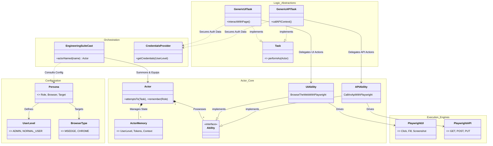
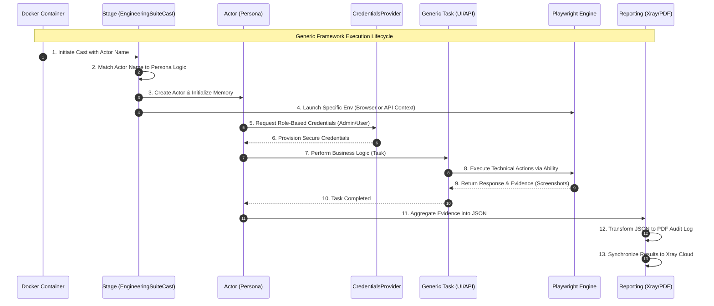

# Confluence Page 2: Architecture & Design

## 🏛️ 1. The Screenplay Pattern
This framework implements the **Screenplay Pattern**, which treats tests as actors performing tasks to achieve goals.

### 1.1 Detailed Generic Class Diagram
*Visual representation of framework relationships, independent of specific test cases.*

## 🚀 2. Generic Architecture & Execution Sequence
*End-to-end lifecycle of a generic test (UI or API).*

## 🎭 3. Ability-Driven Casting
Unlike standard casting, our `EngineeringSuiteCast` dynamically provisions actors:
*   If **Alex** is summoned, the cast launches an **MSEdge** instance and assigns an **Admin** role.
*   If **Charlie** is summoned, the cast initializes only a **Playwright APIRequestContext**, ensuring zero UI overhead for API tests.

---
*Next Page: [Security & Auth Flow](./03_Security_Auth_Flow.md)*
