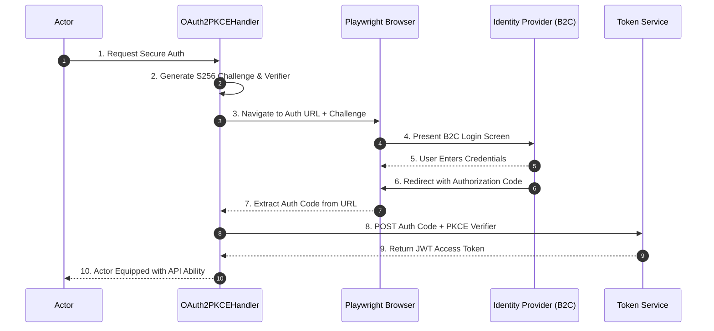

# Confluence Page 3: Security & Auth Flow

## 🔐 1. OAuth2 with PKCE Handshake
The framework is specialized for secure Azure B2C login screens using the PKCE (Proof Key for Code Exchange) flow.

### 1.1 Technical Sequence Diagram

## 🔑 2. Secure Credential Management
The framework avoids hardcoded strings through the **`CredentialsProvider`** utility.

### 2.1 Dynamic Loading Logic
1.  **Actor Memory**: During casting, the actor is assigned a `UserLevel` (Admin or Normal).
2.  **Provider Request**: When a login task executes, it requests credentials for that level from the provider.
3.  **Environment Sync**: The provider pulls from System Environment Variables (e.g., `ADMIN_USER`, `ADMIN_PASS`).
4.  **Fallback**: If no environment variables are found (local dev), it uses defaults specified in the configuration.

---
*Next Page: [Execution & CI/CD](./04_Execution_CICD.md)*
