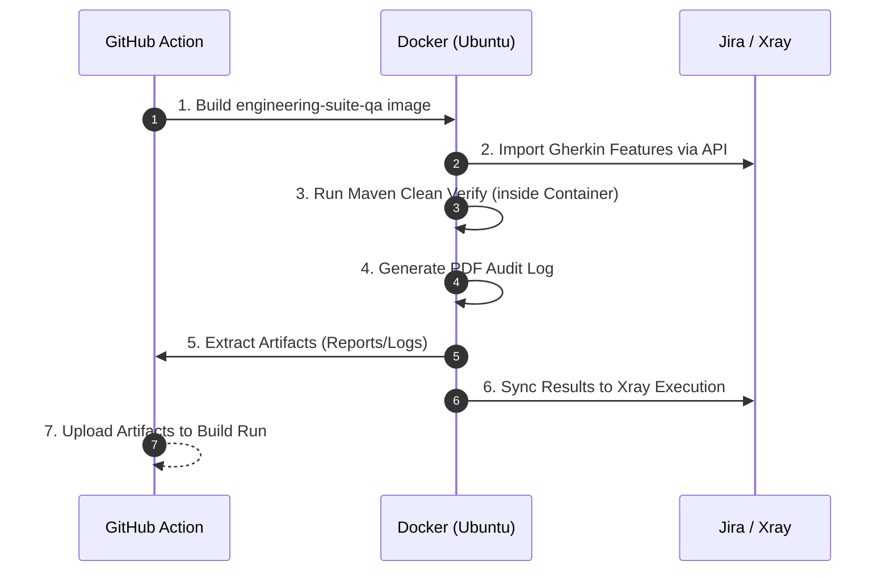

# Confluence Page 4: Execution & CI/CD

## 🐳 1. Docker-Native Execution
To ensure "Zero Drift" between local machines and the cloud, all tests are initiated through the **`Dockerfile`**.

### 1.1 Docker Environment Details
*   **Base Image**: `mcr.microsoft.com/playwright/java:v1.40.0-jammy`
*   **Pre-installed**: Maven 3.x, MSEdge, Google Chrome, and required Linux libraries.
*   **Auto-Execution**: The container CMD initiates both the test run and the subsequent PDF audit log generation.

## 🔄 2. CI/CD Lifecycle (GitHub Actions)
The pipeline is fully automated and triggered on-demand via **Workflow Dispatch**.

### 2.1 Workflow Steps (Vertical Flow)


## 🚀 3. How to Run
### 3.1 Local (Maven)
```bash
mvn clean verify -Denvironment=qa -Dplaywright.browser=chrome
```

### 3.2 Local (Docker)
```bash
docker build -t engineering-suite-qa .
docker run -e ENVIRONMENT=qa -e BROWSER=msedge engineering-suite-qa
```

---
*Next Page: [Reporting & Compliance](./05_Reporting_Compliance.md)*
