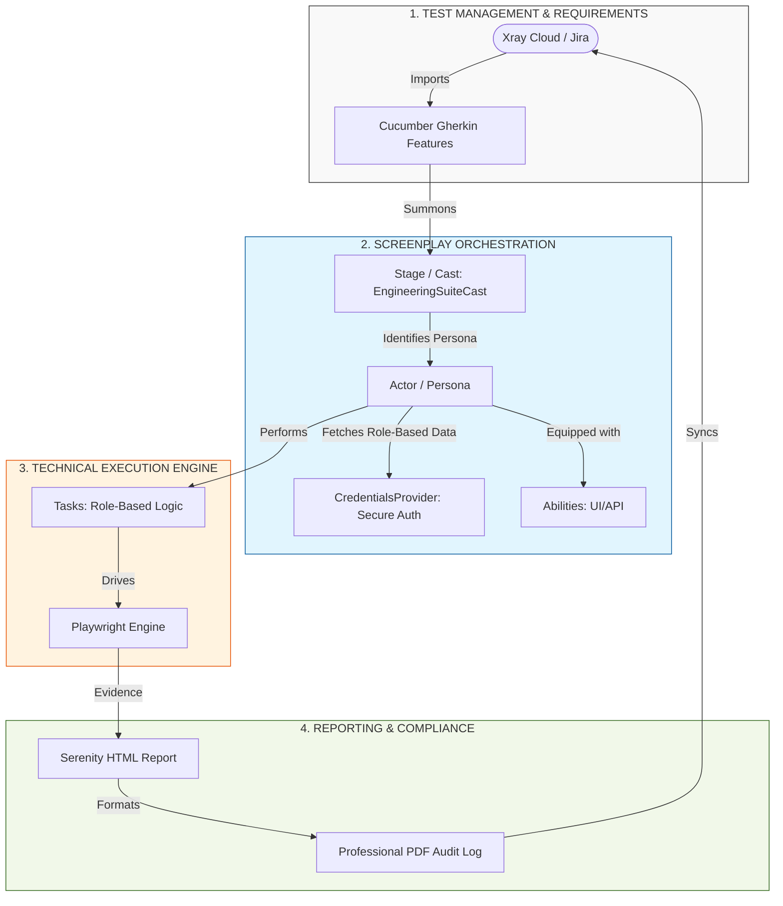
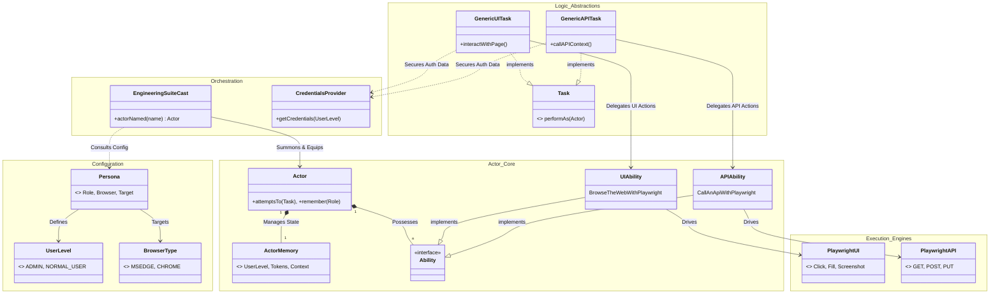
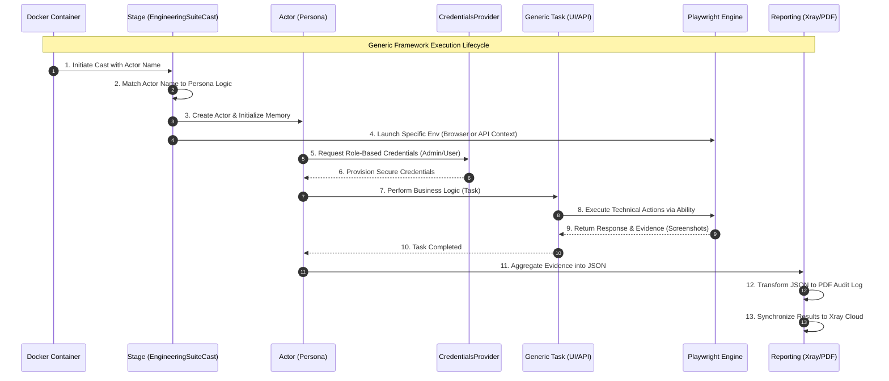
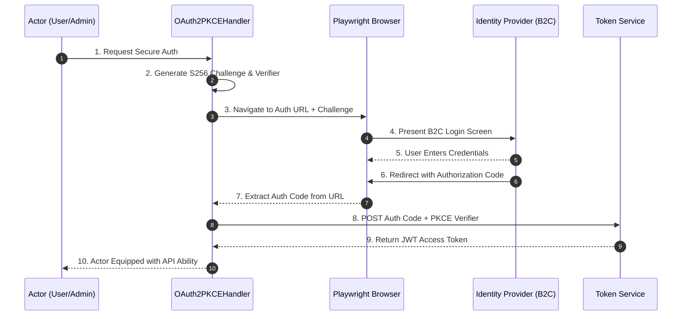

# Confluence Documentation: Engineering Suite Automation Framework

## 🎯 1. Objective & Design Philosophy
The **Engineering Suite Automation Framework** is an enterprise-level, BDD-driven solution designed to provide high-performance, audit-ready testing for Lenze Engineering Suites. 

### 1.1 Core Pillars
*   **Playwright-First**: A single engine for UI and REST API automation.
*   **Screenplay Pattern**: SOLID-based design using Tasks, Interactions, and Questions.
*   **Ability-Driven Casting**: Staging and casting depend strictly on defined **Abilities** (via `EngineeringSuiteCast`).
*   **Secure Credential Management**: Role-based credentials (Admin/User) are retrieved from secure stores via `CredentialsProvider`.
*   **Docker-Native**: Absolute environment parity via containerization.

---

## 🏗️ 2. Architectural Overview

### 2.1 Framework Architecture Diagram (Top-Down Flow)

### 2.2 Detailed Generic Class Diagram
*Visual representation of framework structural flow and relationships.*

---

## 🔄 3. Detailed Test Execution Lifecycle

### 3.1 Generic Architecture & Execution Sequence
*End-to-end lifecycle of a generic test (UI or API).*

---

## 🔐 4. OAuth2 with PKCE Authentication Flow
*Technical handshake using Playwright to handle B2C login.*

---

## 👥 5. Persona Management Matrix
| Persona | Name | Role | Browser | Primary Type |
| :--- | :--- | :--- | :--- | :--- |
| **ALEX** | Alex | ADMIN | **MSEdge** | UI |
| **CHRIS** | Chris | ADMIN | **Chrome** | UI |
| **BLAKE** | Blake | NORMAL | **MSEdge** | UI |
| **CASEY** | Casey | NORMAL | **Chrome** | UI |
| **CHARLIE**| Charlie| ADMIN | N/A | API |
| **DANA** | Dana | NORMAL | N/A | API |

---

## 📊 6. Reporting & Artifacts
1.  **Serenity HTML**: Interactive engineering dashboard.
2.  **PDF Audit Log**: Professional compliance document with screenshots.
3.  **Xray Sync**: Automated bidirectional requirement sync.
