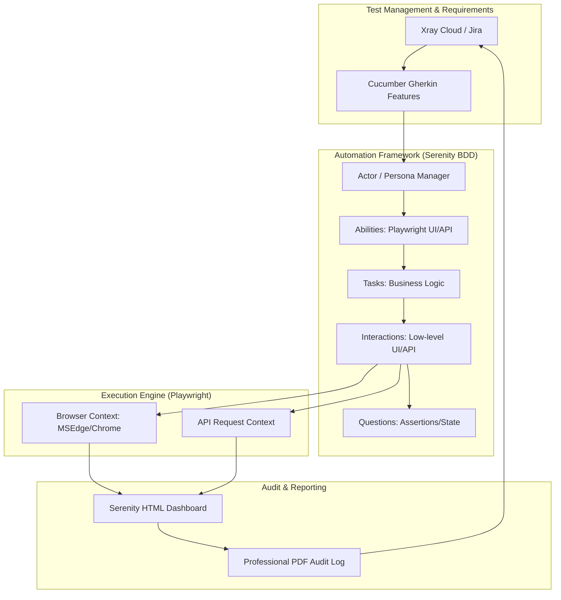
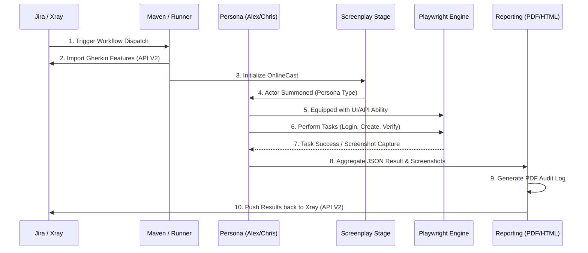
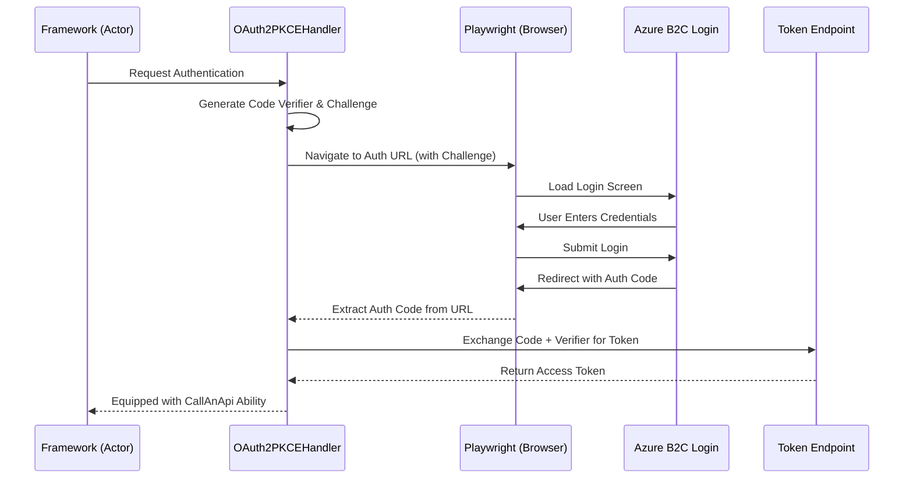
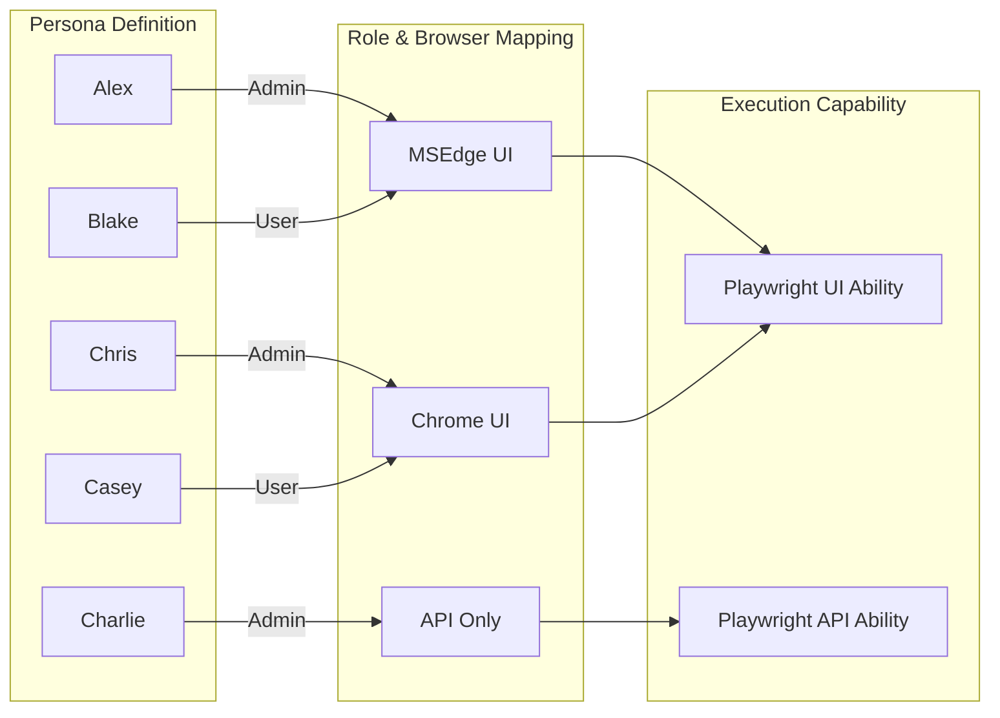

# Mermaid Diagrams: Engineering Suite Automation Framework

Use the following Mermaid.js code blocks in Confluence (via the Mermaid macro) or any Markdown-compatible tool to generate the architecture and sequence diagrams.

---

## 🏛️ 1. Enterprise Framework Architecture
This diagram shows the layered structure of the framework and how it connects to external systems.

---

## 🔄 2. Detailed Test Execution Sequence
This shows the step-by-step lifecycle of a single test execution.

---

## 🔐 3. OAuth2 with PKCE Authentication Flow
This illustrates the interaction between the framework and the B2C login screens.

---

## 👥 4. Persona & Capability Matrix
This shows how the framework maps personas to their specific roles and targets.

